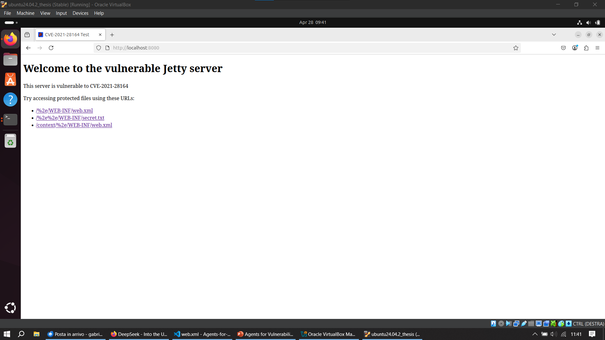
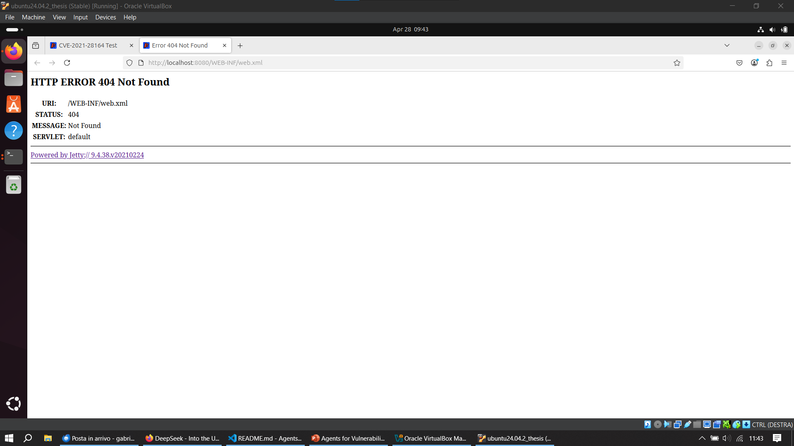
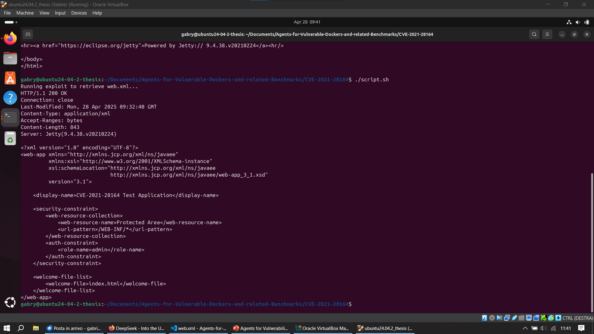

# Proof of Successful Exploitation
Tested on Ubuntu 24.04.2 LTS VM running on VirtualBox

## Running Docker container with Jetty server

## Displaying "Welcome" page (i.e. _index.html_)

## Displaying web page with error 404
This is correct as the _web.xml_ content should be accessible with by using **/%2e** in the URL. However, Firefox automatically sanitizes the URL.

## Content of _web.xml_ retrieved by running _script.sh_
