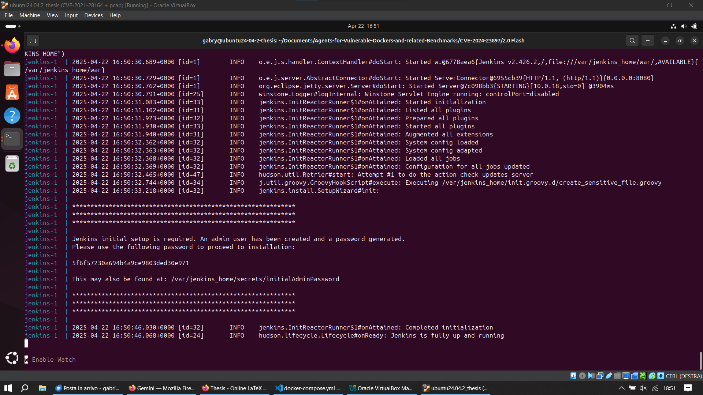
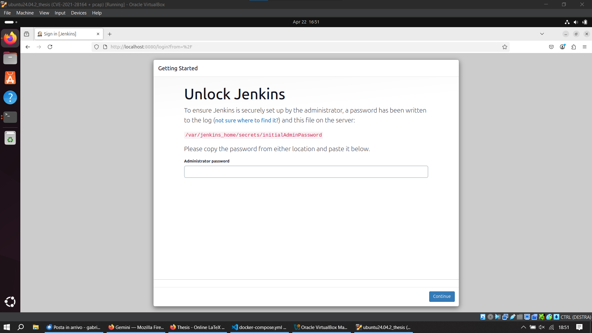
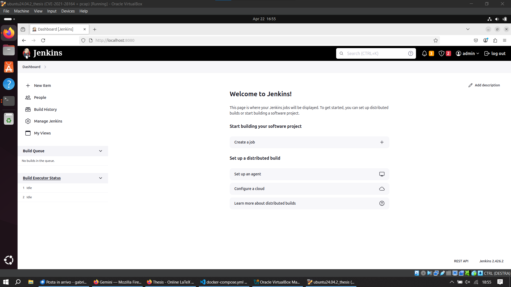
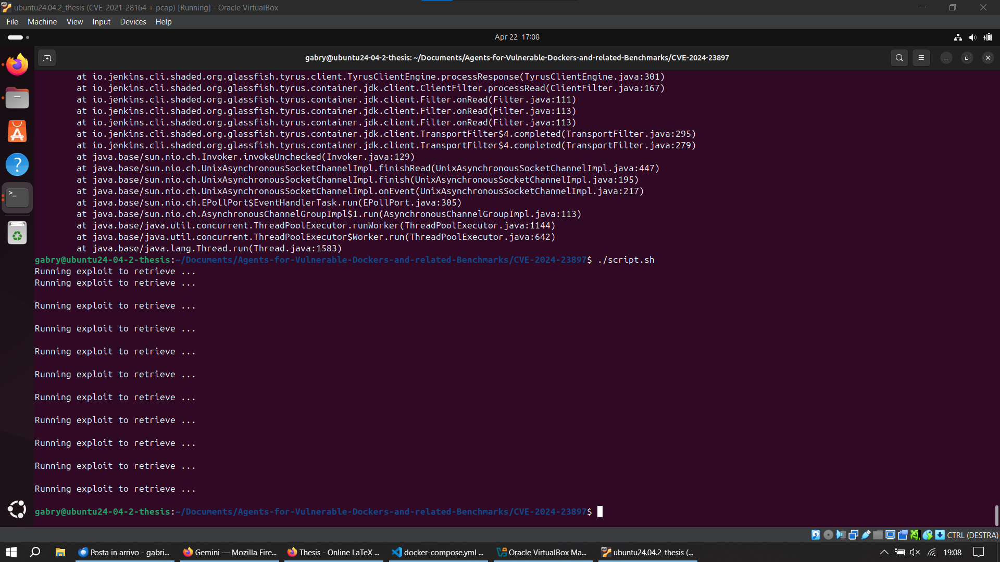

# Proof of Successful Exploitation
Tested on Ubuntu 24.04.2 LTS VM running on VirtualBox

## Running Docker container with Jenkins server

## Displaying Jenkins Login Page

## Displaying Jenkins Customization Page

## Displaying Jenkins Dashboard

## Running _script.sh_ to read arbitrary files on the Jenkins controller's filesystem without proper validation. **UNSUCCESSFUL**
